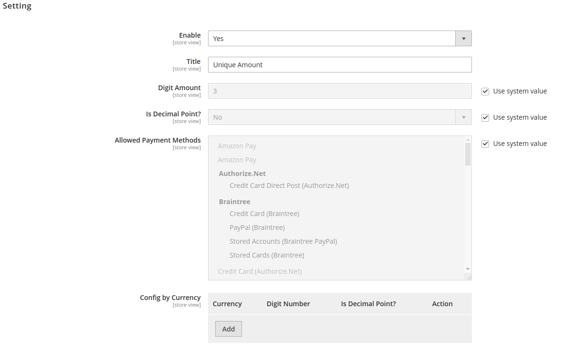

# Xtendable_UniqueTotal

Additional custom total with unique amount for manual payment

@version     1.0.0, last modified May 2020

@author 	 Didi Kusnadi<jalapro08@gmail.com>

@link        http://didikusnadi.com

---
##### Version 1.0

Initial Release

##### Minimum Requirement

Magento 2.2

##### How to Install

   ```composer require xtendable/unique-total```

##### Configure unique amount from Backend

